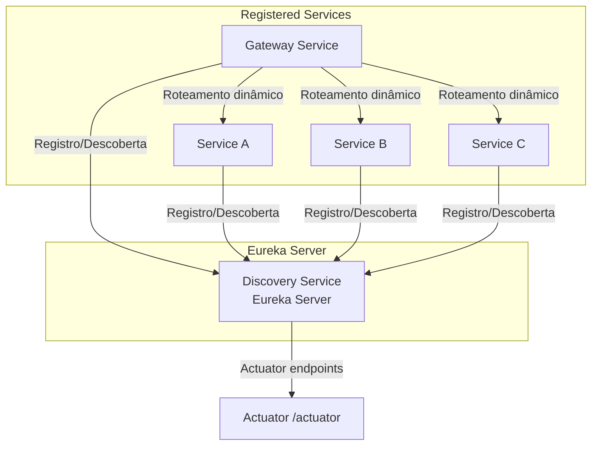

# Discovery Service

O `discovery-service` é o **Service Discovery** do ecossistema de microsserviços.  
Ele utiliza **Spring Cloud Netflix Eureka** para:

- Registro automático de serviços
- Descoberta de serviços para outros microsserviços (ex: Gateway, Service A/B/C)
- Monitoramento via Actuator

---

## Tecnologias e Dependências

- **Java:** 25
- **Spring Boot:** 3.5.6
- **Spring Cloud Netflix Eureka Server:** Service Discovery
- **Spring Boot Actuator:** health e métricas

---

## Estrutura do Projeto

```
discovery-service/
├─ src/main/java/com/infradomain/discoveryservice/
│   └─ DiscoveryServiceApplication.java
├─ src/main/resources/
│   └─ application.yml
├─ Dockerfile
├─ pom.xml
└─ README.md
```

---

## Diagrama Arquitetural (Mermaid)



---

## Como Rodar

1. Clone o repositório:

   ```bash
   git clone https://github.com/taptrack-system/infra-domain.git
   cd infra-domain/discovery-service
   ```

2. Build do projeto:

   ```bash
   mvn clean install
   ```

3. Rodar o Discovery Service:

   ```bash
   mvn spring-boot:run
   ```

Ou via Docker:

```bash
docker build -t discovery-service:latest .
docker run -p 8761:8761 discovery-service:latest
```

---

## Endpoints Principais

* **Interface do Eureka:**
  `http://localhost:8761`

* **Actuator:**

    * `http://localhost:8761/actuator/health`
    * `http://localhost:8761/actuator/metrics`
    * `http://localhost:8761/actuator/info`

---

## Observações

* Serviços clientes (ex: `gateway-service`, `service-a`) devem configurar:

  ```properties
  eureka.client.service-url.defaultZone=http://localhost:8761/eureka/
  ```
* Para desenvolvimento local, é comum desativar a auto-preservação (`enable-self-preservation=false`) para refletir
  mudanças mais rapidamente.
* Em produção, recomenda-se manter a auto-preservação ativa.

---

## License

Este projeto está licenciado sob a [Apache License 2.0](http://www.apache.org/licenses/LICENSE-2.0).
