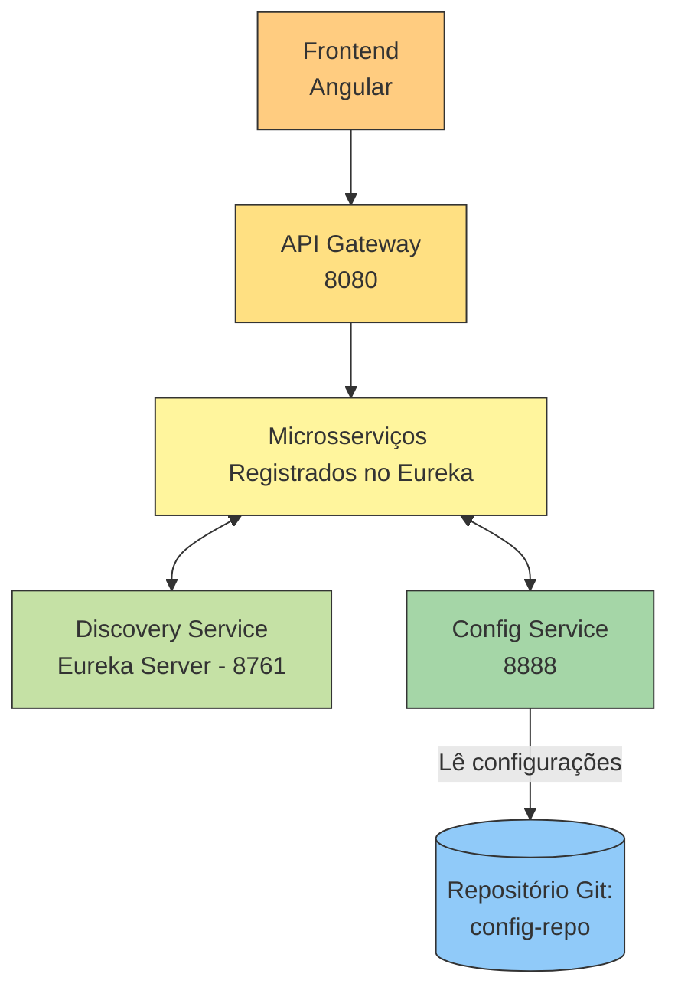
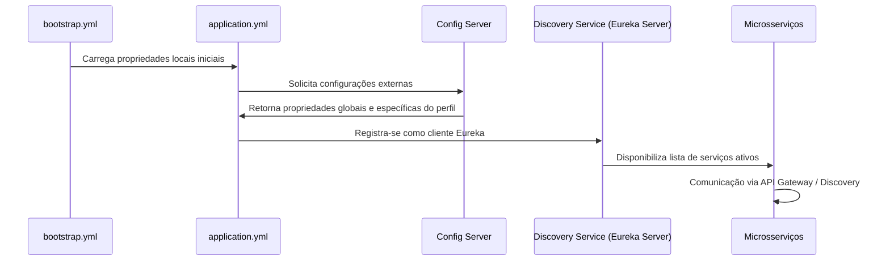

# Discovery Service (Eureka Server)

1. [Visão Geral](#visão-geral)
2. [Arquitetura e Diagramas](#arquitetura-e-diagramas)
    * [Diagrama de Integração Geral](#diagrama-de-integração-geral)
    * [Fluxo de Inicialização e Configuração](#fluxo-de-inicialização-e-configuração)
3. [Configuração e Fluxo de Propriedades](#configuração-e-fluxo-de-propriedades)
    * [`bootstrap.yml`](#bootstrapyml)
    * [`application.yml`](#applicationyml)
4. [Stack Tecnológica](#stack-tecnológica)
5. [Estrutura do Projeto](#estrutura-do-projeto)
6. [Execução e Configuração](#execução-e-configuração)
    * [Pré-requisitos](#pré-requisitos)
    * [Executar localmente](#executar-localmente)
   * [Executar com Docker Compose](#executar-com-docker-compose)
7. [Funcionamento Interno](#funcionamento-interno)
8. [Endpoints e Integrações](#endpoints-e-integrações)
9. [Boas Práticas](#boas-práticas)
10. [Licença](#licença)
11. [Autora](#autora)

---

## Visão Geral

O **Discovery Service** é o componente responsável pelo **registro e descoberta de microsserviços** dentro do
ecossistema **Tap Track**.  
Ele atua como **servidor Eureka (Spring Cloud Netflix Eureka Server)**, permitindo que cada microsserviço cliente se
registre automaticamente e descubra outros serviços sem a necessidade de configurações estáticas de rede.

Este serviço é essencial para a **arquitetura de microsserviços**, pois centraliza as informações de localização (
host/port) e o estado dos serviços, permitindo **balanceamento dinâmico de carga, resiliência e escalabilidade**.

---

## Arquitetura e Diagramas

### Diagrama de Integração Geral



### Fluxo de Inicialização e Configuração



## Configuração e Fluxo de Propriedades

As propriedades do **Discovery Service** são separadas em dois arquivos:

### `bootstrap.yml`

Contém configurações **de inicialização** e **integração com o Config Server**.

```yml
spring:
  application:
    name: discovery-service
  cloud:
    config:
      uri: http://localhost:8888
      name: discovery-service
      profile: dev
      label: main

  profiles:
    active: dev

# Porta padrão do servidor Eureka
server:
  port: 8761
```

### `application.yml`

Contém configurações **locais** e **operacionais** da aplicação.

```yml
server:
  port: 8761

spring:
  application:
    name: discovery-service

eureka:
  client:
    register-with-eureka: false
    fetch-registry: false
  server:
    enable-self-preservation: true
    eviction-interval-timer-in-ms: 60000
  instance:
    hostname: localhost

management:
  endpoints:
    web:
      exposure:
        include: health,info
  endpoint:
    health:
      show-details: always

info:
  app:
    name: ${spring.application.name}
    description: Servidor Eureka para registro e descoberta de microsserviços
    version: 1.0.0
    maintainer: Juliane Maran
    contact: julianemaran@gmail.com
    license: Apache-2.0
```

---

## Stack Tecnológica

| Categoria       | Tecnologias                         |
|-----------------|-------------------------------------|
| Linguagem       | Java 25                             |
| Framework       | Spring Boot 3.5.6                   |
| Cloud           | Spring Cloud 2025.x (Eureka Server) |
| Configuração    | Spring Cloud Config Server          |
| Monitoramento   | Spring Boot Actuator                |
| Logging         | SLF4J + Logback                     |
| Testes          | JUnit 5, Mockito                    |
| Build           | Maven 3.9.x                         |
| Containerização | Docker, Docker Compose              |

---

## Estrutura do Projeto

```
discovery-service/
├── src/
│   ├── main/
│   │   ├── java/com/infradomain/discoveryservice/
│   │   │   ├── DiscoveryServiceApplication.java
│   │   │   └── config/
│   │   └── resources/
│   │       ├── bootstrap.yml
│   │       ├── application.yml
│   │       └── logback-spring.xml
│   └── test/
│       └── java/com/infradomain/discoveryservice/
│           └── DiscoveryServiceApplicationTests.java
├── Dockerfile
├── pom.xml
└── README.md
```

---

## Execução e Configuração

### Pré-requisitos

* **Java 25**
* **Maven 3.9+**
* **Docker (opcional)**
* **Spring Cloud Config Server** em execução (porta 8888)

### Executar localmente

```bash
mvn spring-boot:run
```

Acesse o Eureka Dashboard:

```
http://localhost:8761
```

### Executar com Docker Compose

```bash
docker-compose up -d
```

---

## Funcionamento Interno

* O **Discovery Service** atua como **Eureka Server**, responsável por registrar e monitorar todos os microsserviços.
* Os microsserviços clientes usam o **Eureka Client** para se registrar automaticamente.
* O **API Gateway** consulta o Discovery Service para rotear as requisições.
* Caso um microsserviço fique indisponível, o Eureka remove-o do registro após o período configurado de expiração (
  `eviction-interval-timer-in-ms`).

---

## Endpoints e Integrações

| Endpoint           | Descrição                                           |
|--------------------|-----------------------------------------------------|
| `/eureka`          | Interface REST para registro/descoberta de serviços |
| `/actuator/health` | Verifica o estado da aplicação                      |
| `/actuator/info`   | Exibe metadados definidos no `application.yml`      |
| `/`                | Painel de controle Eureka (UI Web)                  |

---

## Boas Práticas

* Sempre iniciar o **Config Server** antes do **Discovery Service**.
* Utilizar perfis (`spring.profiles.active`) para separar ambientes (`dev`, `test`, `prod`).
* Desabilitar o modo `self-preservation` em ambientes de desenvolvimento para testes rápidos.
* Em produção, configurar múltiplas instâncias do Discovery Service com replicação (`peer awareness`).
* Manter os logs centralizados e integrar com o **Elastic Stack (ELK)** futuramente.

---

## Licença

Este projeto faz parte do ecossistema **Tap Track** e é distribuído sob a **licença interna da organização**.
Uso e distribuição externa dependem de autorização formal.

---

## Autora

**Juliane Maran**

*Backend Java Developer | Software Engineer (Spring Boot, APIs REST, Microservices)*

📧 [julianemaran@gmail.com](mailto:julianemaran@gmail.com)